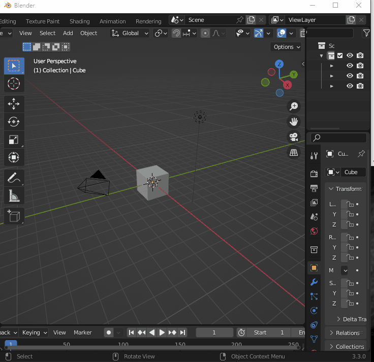

# simple_fbxexport

Please click here to download.

<a href="https://github.com/Hydrocallis/simple_fbxexport/releases/download/simple_fbxexport/simple_fbxexport.zip" rel="nofollow" data-turbo="false" data-view-component="true" class="Truncate">
    simple_fbxexport.zip
    
</a>

## What is this?

Blender FBX output settings created in the 3D panel.
Add-on.

The basic usage of this add-on is to
Save the blender file, or
destination where you want the file to be saved.

The file will be saved in a subfolder at that destination.

